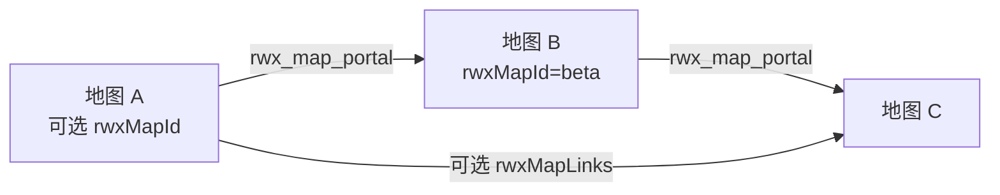

# 地图联通

地图联通（Linked Maps / Map Links / 地图传送门）让一场对战可以跨越多张 TMX 地图。单位通过传送门对象，可以转移到另一张地图实例。

客户端广播的特性 ID：`mapLinks`。

## 概念



- **传送门**是 `type="rwx_map_portal"` 的地图对象。
- 每个传送门通过 `targetMapId` 指向目标地图。
- 目标地图应声明稳定的 `rwxMapId`，方便解析。
- 多人模式下，若联通图需要多张“活地图”，RWX 会把人类玩家分配到不同地图实例。

## 地图制作

### 1. 给每张地图一个稳定 ID

在目标地图的 `map_info` 上：

```xml
<object name="map_info" x="0" y="0" width="64" height="64">
  <properties>
    <property name="rwxMapId" value="beta"/>
  </properties>
</object>
```

别名：`rwxMapId` / `rwx_map_id`。

### 2. 放置传送门

```xml
<object name="to_beta" type="rwx_map_portal" x="0" y="0" width="64" height="64">
  <properties>
    <property name="targetMapId" value="beta"/>
    <!-- 可选：指定目标地图上的传送门 id -->
    <!-- <property name="targetPortalId" value="entry"/> -->
  </properties>
</object>
```

### 3. 可选的显式链接列表

也可在 `map_info` 中声明：

```xml
<property name="rwxMapLinks" value="exitA|beta;exitB|gamma"/>
```

别名：`rwxMapLinks` / `rwx_map_links`。

条目用 `;` 或换行分隔，每条可以是：

- `portalName|targetMapId`
- 或仅 `targetMapId`

## 运行时行为

- 单位进入传送门后，RWX 会发送 `portalTransfer` 特性消息（单位类型、阵营、生命比例、朝向等）。
- 目标地图必须能在资源地图或用户地图目录中解析到。
- 若目标缺失，开战准备会报告 missing target map ids。
- 多人联通对战要求： **每张需要运行的地图实例至少有 1 名人类玩家**。

## 检查清单

1. 所有目标地图都有 `rwxMapId`
2. 所有传送门都有有效的 `targetMapId`
3. 目标地图文件存在（assets 或外部 maps 目录）
4. 联机房间人类玩家数量不少于地图实例数

## 相关文档

- [区域控制](./area-control)
- [P2P 联机](./p2p)
