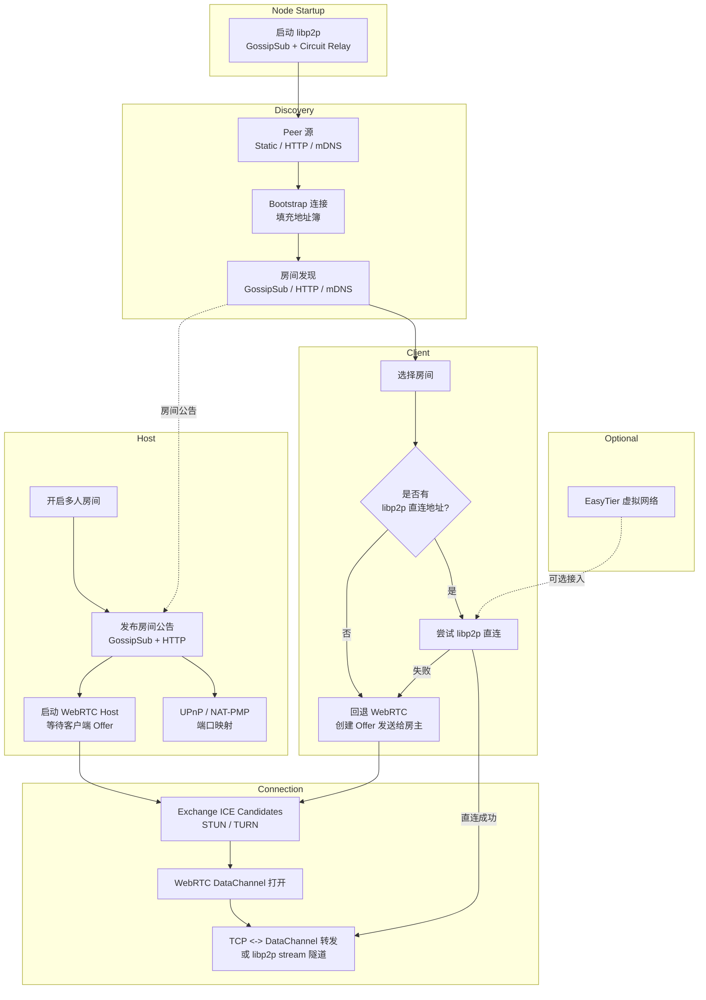

# P2P 联机

RWX 的 P2P 联机用于在没有传统房间服务器转发游戏流量的情况下建立多人游戏连接。当前实现以 WebRTC DataChannel 作为主要游戏数据通道，并使用 libp2p GossipSub 作为房间发现和 WebRTC 信令通道。

## 当前状态

P2P 联机仍属于实验性功能。它的目标是提高公网环境下的直连成功率，但不能保证所有网络都能连通。

主要特性：

- 游戏流量默认走 WebRTC DataChannel。
- WebRTC 使用 ICE/STUN/TURN 进行 NAT 穿透。
- libp2p 负责 P2P 房间公告、刷新和 WebRTC offer/answer/ICE candidate 信令。
- 局域网内会通过 mDNS 发现附近 libp2p 节点。
- 如果 WebRTC 不可用，仍保留 libp2p stream tunnel 作为直接地址可用时的备用通道。

## 连接流程

创建 P2P 房间时：

1. 游戏先启动普通多人房间。
2. P2P 服务启动 libp2p host，并加入 lobby gossip topic。
3. 房主开始定期发布房间公告。
4. 房主启动 WebRTC host 端，等待加入者通过 gossip 发送 offer。
5. 房间公告中包含 WebRTC 信令方式和 ICE server 列表。

加入 P2P 房间时：

1. 客户端从 gossip 房间列表选择房间。
2. 客户端在本机启动一个临时 TCP 监听端口。
3. 游戏客户端连接到 `127.0.0.1:<临时端口>`。
4. P2P 层创建 WebRTC DataChannel offer，并通过 gossip 发给房主。
5. 房主返回 answer，双方继续交换 ICE candidate。
6. DataChannel 打开后，P2P 层在本地 TCP socket 和 DataChannel 之间转发游戏字节流。

简化结构：



## 本地 P2P 配置

所有 P2P 网络设置都从游戏工作目录下的本地 `p2p.toml` 读取。

如果文件不存在，RWX 会在启动时创建默认配置。

示例：

```toml
[libp2p]
peers = [
  "/dnsaddr/bootstrap.libp2p.io/ipfs/QmNnooDu7bfjPFoTZYxMNLWUQJyrVwtbZg5gBMjTezGAJN",
  "/dnsaddr/bootstrap.libp2p.io/ipfs/QmQCU2EcMqAqQPR2i9bChDtGNJchTbq5TbXJJ16u19uLTa"
]
peerSources = [
    "https://p2p-lobby-services.shuangx339.workers.dev"
]

[libp2p.proxy]
bufferSize = 65536
readTimeoutMs = 30000
streamOpenTimeoutMs = 10000
connectTimeoutMs = 5000
idleTimeoutMs = 120000
tcpKeepAlive = true
tcpNoDelay = true

[webrtc]
iceServers = [
  "stun:stun.l.google.com:19302",
  "stun:stun1.l.google.com:19302",
    "stun:openrelay.metered.ca:80",
    "turn:openrelayproject:openrelayproject@openrelay.metered.ca:443"
]

[webrtc.proxy]
bufferSize = 65536
openTimeoutMs = 20000
socketConnectTimeoutMs = 5000
socketReadTimeoutMs = 30000
executorThreads = 4

[nat]
enableUpnp = true
enablePcp = true
pcpLifetimeSeconds = 3600
pcpTimeoutMs = 3000
mappingDescription = "RWX P2P"

[relay]
enableCircuitRelayV2 = true
enableDcutr = false
relayReservationCount = 1
maxRelayReservations = 16
maxRelayReservationSeconds = 3600
relayPeers = []
bootstrapRelays = []

[discovery]
enableGossipSub = true
enableMdns = true

[discovery.service]
# HTTP lobby service endpoints for room discovery. Each URL can be a base URL or /rooms.
enable = true
urls = [
    "https://p2p-lobby-services.shuangx339.workers.dev"
]
refreshIntervalMs = 15000
timeoutMs = 5000
maxBytes = 262144
maxRoomsPerUrl = 200

[discovery.service.publish]
# Optional: publish this client's hosted room to the lobby service.
enable = true
timeoutMs = 5000
updateIntervalMs = 15000
roomTtlMs = 600000
deleteOnClose = true

[discovery.dht]
enable = false
namespace = "/rwx/lobby/v1"
provideIntervalMs = 30000
queryIntervalMs = 15000
queryTimeoutMs = 10000
maxProviders = 50

[lobby]
roomAnnounceIntervalMs = 3000
roomTtlMs = 15000
bootstrapConnectTimeoutMs = 10000
mdnsPeerAddressTtlMs = 30000
```

### libp2p Peers

`[libp2p].peers` 控制用于公网房间发现和 WebRTC GossipSub 信令的 peer。这些 peer 不是 TURN 中继，不承载游戏流量。

`[libp2p].peerSources` 指向提供节点查询的服务HTTP URL。它可以在不发布新客户端的情况下提供不稳定或测试用途的 rendezvous/bootstrap 节点。节点列表格式如下：

这些节点只帮助玩家互相发现并交换 gossip/信令消息。它们不是 TURN server，也不会转发 WebRTC 游戏流量。

### 房间发现 Service 

`[discovery.service].urls` 指向提供房间发现服务的 HTTP URL。

`[discovery.service.publish]` 配置房间公告服务。

### DHT 发现

DHT(Distributed Hash Table) 可以在没有中心化服务器的情况下实现点对点数据发现和交换。RWX 计划在后续版本中支持基于 libp2p Kademlia DHT 的房间发现和信令，但当前版本暂不支持。

`[discovery.dht]` 目前是占位配置。当前内置的 `jvm-libp2p 1.2.0` 没有暴露可用的 Kad-DHT provider API，因此启用后只会输出警告。该配置保留给后续库升级使用。

### WebRTC ICE Servers

`[webrtc].iceServers` 控制 WebRTC DataChannel 使用的 ICE server 列表。

支持的格式：

```text
stun:stun.l.google.com:19302
turn:user:pass@example.com:3478
turns:user:pass@example.com:5349
```

如果列表为空或无效，RWX 会使用默认免费 STUN：

```text
stun:stun.l.google.com:19302
stun:stun1.l.google.com:19302
```

STUN 只能帮助多数普通 NAT 打洞，不能保证所有网络可用。TURN 是真正的中继兜底，通常需要你自己准备账号或使用第三方服务。

### Proxy 与 Lobby 超时

`[libp2p.proxy]`、`[webrtc.proxy]`、`[nat]`、`[relay]` 和 `[lobby]` 用于调整本地代理 buffer、socket 超时、NAT 映射、中继行为、房间公告间隔、房间 TTL 和 bootstrap 连接超时。只有在日志显示网络建立过慢时才建议增大超时；过大的值会让失败连接更晚返回错误。

### NAT 映射

`[nat].enablePcp` 会优先尝试 PCP TCP 端口映射。当前 PCP 会读取本地默认网关；如果 PCP 失败，并且 `[nat].enableUpnp` 为 true，RWX 会继续回退到 UPnP。

### Circuit Relay 与 DCUtR

`[relay].enableCircuitRelayV2` 会启用当前 `jvm-libp2p` 提供的 circuit relay transport 以及 `/libp2p/circuit/relay/0.2.0` hop/stop 协议。

`relayPeers` 和 `bootstrapRelays` 可以填写 relay multiaddr。为空时，RWX 会尝试把已经连接的 peer 作为 relay candidate。

`enableDcutr` 是为后续兼容预留的配置。当前内置的 `jvm-libp2p 1.2.0` 没有 DCUtR 协议实现，启用后只会输出日志警告。


## EasyTier 集成

[EasyTier](https://github.com/EasyTier/EasyTier) 是一个简单、安全、去中心化的异地组网方案。通过组建虚拟网络，可以让玩家之间获得 **二层 / 三层直连能力**，极大提高 P2P 联机成功率（在双方都接入时可达 >95%）。

考虑到配置相对复杂，请有能力的玩家自行探索，这里不再赘述。

- [Astral公共服务器](https://astral.fan/server-config/server-list/) : 由Astral社区维护的EasyTier公共免费服务器

## 为什么还需要 libp2p

WebRTC 只负责建立和承载游戏数据通道，它本身不提供“如何找到对方”和“如何交换 offer/answer/ICE candidate”的机制。

RWX 当前使用 libp2p 做这些工作：

- 发布和接收 P2P 房间公告。
- 在房主和加入者之间传递 WebRTC offer、answer 和 ICE candidate。
- 在局域网内通过 mDNS 自动发现附近玩家。
- 在公网环境尝试接入默认 libp2p bootstrap 网络。

因此，WebRTC 是主传输，libp2p 是发现和信令层。

## 与传统联机的区别

传统联机通常需要玩家手动输入 IP，或依赖服务器列表。P2P 联机会自动发现 P2P 房间，并尝试用 WebRTC 穿透 NAT。
一旦NAT穿透成功，游戏数据就直接在玩家之间传输，不经过服务器转发，理论上可以降低延迟和服务器成本。

但 P2P 不等于 100% 可连接：

- 双方都是普通家用 NAT 时，STUN 通常有机会成功。
- 一方或双方处于严格 NAT、对称 NAT 或运营商 CGNAT 时，纯 STUN 可能失败。
- 没有 TURN 时，WebRTC 打洞失败就没有可靠兜底。

## 故障排查

看不到房间：

- 确认双方使用相同版本的 RWX。
- 等待几秒后点击刷新。
- 检查防火墙是否阻止 Java/RWX 的网络访问。
- 公网环境下，房间发现依赖 libp2p gossip；如果 bootstrap 网络不可达，房间可能不会出现。

能看到房间但连接失败：

- 尝试配置 TURN server。
- 检查系统防火墙是否拦截 UDP。
- 如果只配置 STUN，严格 NAT 或 CGNAT 下可能无法连接。
- 查看日志中是否有 `WebRTC tunnel failed`、`Failed to publish WebRTC signal` 或 native WebRTC 初始化错误。

TURN 配置无效：

- 确认格式为 `turn:user:pass@host:port` 或 `turns:user:pass@host:port`。
- 确认账号密码有效。
- 确认 TURN 服务允许 UDP/TCP 中继。

## 限制

- 当前没有内置免费的 TURN 中继服务。
- 默认 STUN 节点不转发流量，只提供地址发现。
- WebRTC native 库需要对应平台支持。
- libp2p gossip 的公网发现效果取决于 bootstrap 网络和连接情况。
- P2P 功能仍在迭代中，建议遇到问题时保留日志便于排查。
